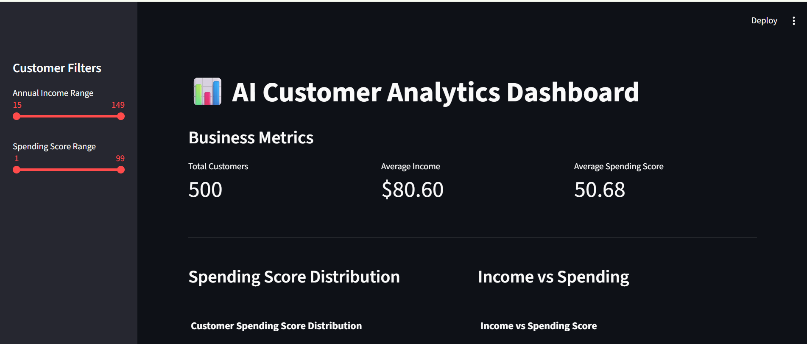
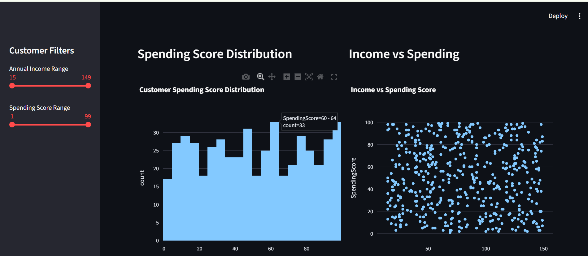
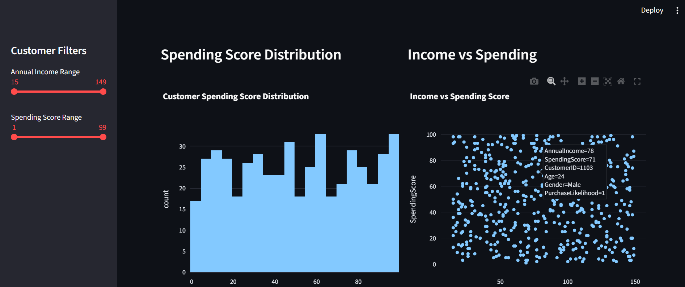
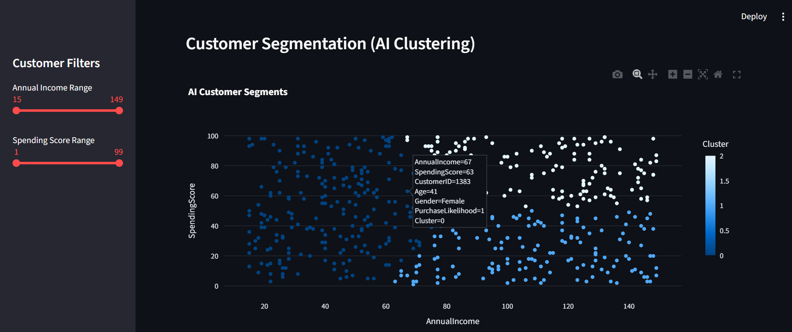
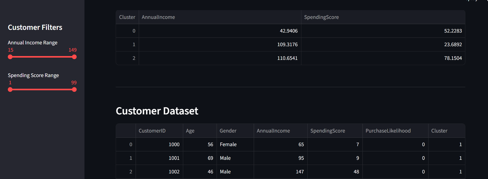

  

# AI Customer Analytics Dashboard
An interactive customer analytics dashboard built using Streamlit, Plotly, and Machine Learning.

## Dashboard Preview

## Features
- Interactive KPI metrics
- Customer spending analysis
- Income vs spending visualization
- AI-based customer segmentation using KMeans
- Dynamic filtering using Streamlit sidebar
- Downloadable filtered dataset

## 🛠 Tech Stack

- Python
- Streamlit
- Plotly
- Pandas
- Scikit-learn
  
## 📊 Dataset
Sample customer dataset containing:
- Customer ID
- Annual Income
- Spending Score
Used for customer segmentation and analytics visualization.

## 🚀 Run the Project

Install dependencies:
pip install -r requirements.txt
Run the Streamlit dashboard:
streamlit run customer_analysis.py

